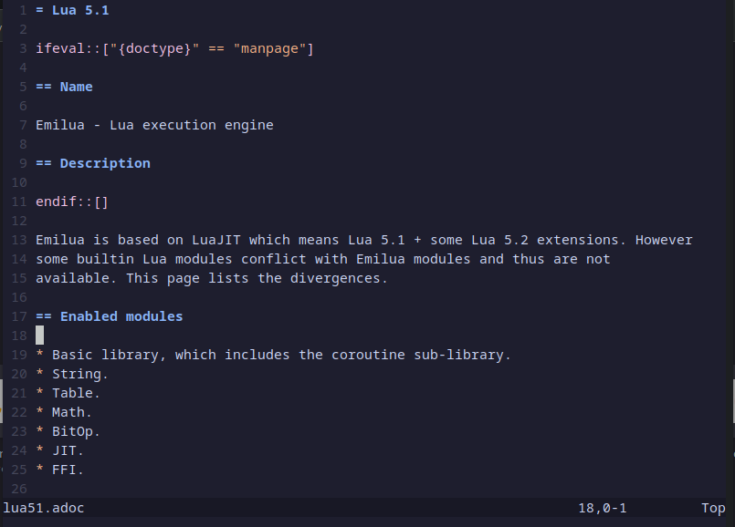
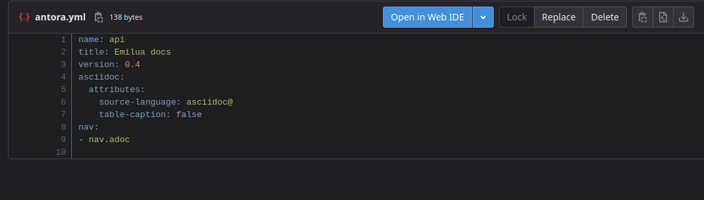
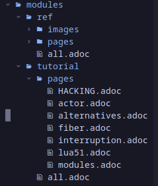
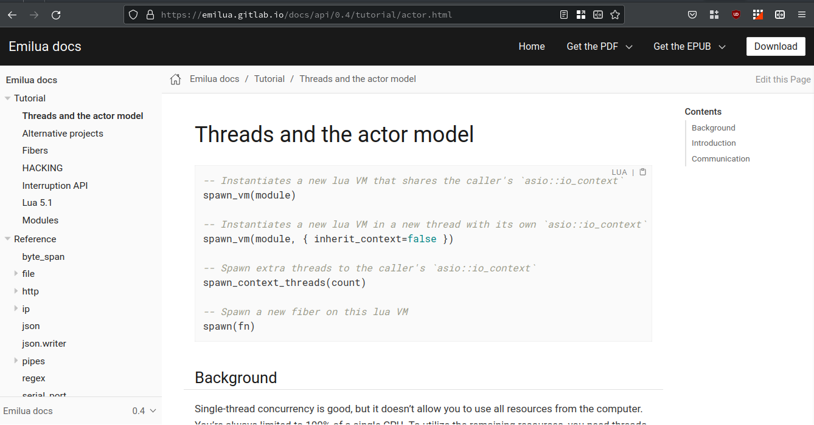
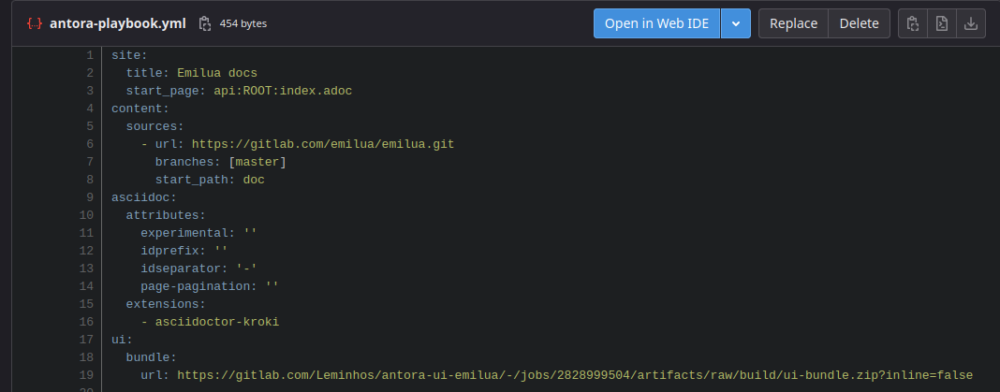
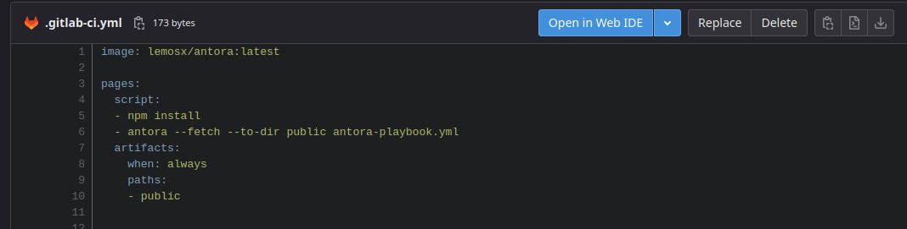

:date: 21/12/2022 
:author: José Lemos 

= Antora: Documentação eficiente com asciidoc

== ASCIIDOC: Apresentação:

* Formato simples para documentos 
* Criado em 2002 para plain-text
* "a2x, asciidoc.py 
* Alternativas 

== Um documento asciidoc 

== Antora: Documentação web com asciidoc 

* "Sabor" asciidoctor para asciidoc

* Extensões 
- Usadas para adicionar funções como diagrams, source highlighting, havendo diferença entre asciidoctor e
asciidoctor.js

* asciidoctor.js vs asciidoctor (ruby)

== Antora.yml e Conteúdo 

* Estrutura e Hierarquia de diretórios do antora

* Components e versionamento
- Cada component corresponde, geralmente, à documentação de uma versão do software documentado ou a ser documentado, com botões para visualizar as outras versões em uma barra no menu esquerdo.

* Contenedor de conteúdo 

== antora.yml 

== Estrutura da Documentação 

== Playbook Repository/Project 

* Repositório a Parte
- O antora deve ficar contido em um Repositorio, geralmente, a parte, para que seja feito o processo a partir do conteúdo do repositório remoto.

* antora-playbook.yml 

== Emilua no Antora

== Deploy do site

* CI/CD e Antora 
* Projeto final, Componentes e scripts 
* Pages

== Snippet 1: antora-playbook.yml

== Snippet 2: Gitlab-CI

== Obrigado!

* **Perfis GH/GL** 
* https://gitlab.com/Leminhos
* https://github.com/lemosjose

== Fontes:

* **(Em domínio público)**
* https://gitlab.com/emilua/emilua
* https://emilua.gitlab.io/docs/
* https://github.com/lemosjose/antora-presentation
